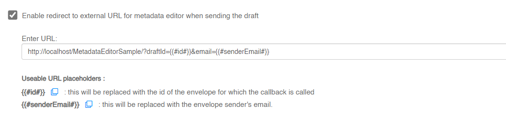
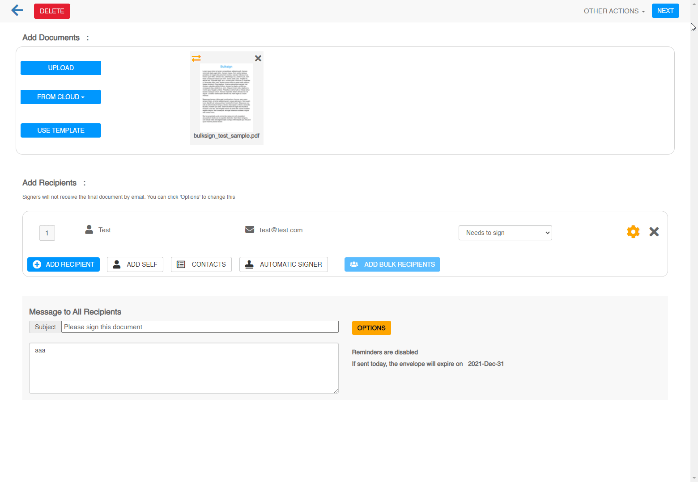

# Metadata Editor Sample

This demo sample shows you how to integrate an external application which sets the metadata information for a Bulksign envelope.
This requires activating the metadata editor feature. Go to Settings \ Policies 

and enable the redirect and set the url for the metadata editor. 

After this is setting is enabled, all drafts will be redirected to that url when sending the envelope.

# How it looks from the user perspective

